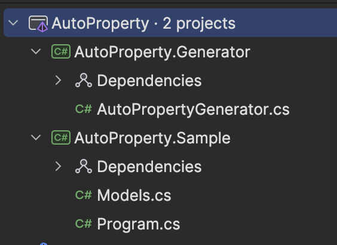

## Exercise 1 | Create Projects & Initial Files

We're going to be starting from a blank solution and creating each project as we need them.

For the first hand-on section, create a new solution file called `AutoProperty.sln`. Once created, complete the following:

### 1) Create the Source generator project

Create a new class library project called `AutoProperty.Generator.csproj`. Ensure the project targets `netstandard2.0` framework. 

You can delete any auto-created classes, then replace the contents of the `AutoProperty.Generator.csproj` with the following

```xml
<Project Sdk="Microsoft.NET.Sdk">
	<PropertyGroup>
        <!-- Generators (and analyzers) need to target netstandard2.0 -->
		<TargetFramework>netstandard2.0</TargetFramework>
		<ImplicitUsings>enable</ImplicitUsings>
		<LangVersion>latest</LangVersion>

        <!-- Analyzers have some pre-defined rules that you have to follow when using certain APIs. This property enforces build errors for invalid operations in generator code -->
        <EnforceExtendedAnalyzerRules>
            true
        </EnforceExtendedAnalyzerRules>
		
        <!-- Special property for IDEs to help with debugging -->
        <IsRoslynComponent>true</IsRoslynComponent>
	</PropertyGroup>

  <!-- The following libraries include the source generator interfaces and types we need -->
	<ItemGroup>
		<PackageReference Include="Microsoft.CodeAnalysis.Analyzers" Version="3.3.4">
			<PrivateAssets>all</PrivateAssets>
			<IncludeAssets>runtime; build; native; contentfiles; analyzers; buildtransitive</IncludeAssets>
		</PackageReference>
		<PackageReference Include="Microsoft.CodeAnalysis.CSharp" Version="4.8.0" />
	</ItemGroup>
</Project>
```

### 2) Create the live sample project

Next create the project that will be used to view live output of the generator when it runs.

Add a new console application project `AutoProperty.Sample.csproj` that targets the `net8.0` frameork. 

Once created, you'll need to add a project reference to `AutoProperty.Generator.csproj`. Since this will be our source generator project, the project reference needs to be updated to include a couple extra flags.

```xml
<ItemGroup>
        <!-- 
            The OutputItemType and ReferenceOutputAssembly inform the compiler that the project is an analyzer and should not a runtime reference.
            As a result, any public types in the project will not be included in the output assembly. 
        -->
        <ProjectReference Include="..\AutoProperty.Generator\AutoProperty.Generator.csproj" OutputItemType="Analyzer" ReferenceOutputAssembly="false"/>
    </ItemGroup>
```

### 3) Create some files for testing

Since this generator is focused on auto-generating interface properties, we need a class and an interface that we can test with.

Create the following on the `AutoProperty.Sample` project; these can be created in whatever file structure you want. For the sake of simplicty this is in a single file.

```csharp
/// Models.cs
///
namespace AutoProperty.Sample;

public interface IAuditMetadata
{
    DateTimeOffset LastUpdated { get; set; }
}

public record Book : IAuditMetadata
{
    public required string Title { get; set; }

    public required string Author { get; set; }

    public DateTimeOffset LastUpdated { get; set; }
}
```


### 4) Create the Source generator class

Lastly, create a new class in `AutoProperty.Generator` called `AutoPropertyGenerator.cs`

```csharp
/// AutoPropertyGenerator.cs
///
using Microsoft.CodeAnalysis;

namespace AutoProperty.Generator;

[Generator]
public class AutoPropertyGenerator : IIncrementalGenerator
{
    public void Initialize(IncrementalGeneratorInitializationContext context)
    {
        // todo: implement the generator
    }
}
```

### Wraping Up

At this point, you should have a solution structure that resembles the image below. 

From here, we'll hands on #2 and create the intial parts of the generator.

