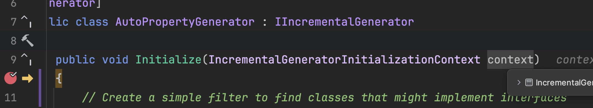

## Exercise 3 | Debugging The Source Generator

As the complexity of the source generator increases, we'll want to debug
it's logic. 

Since the code of a source generator runs at compile time rather than runtime, debugging them is a bit more complex. There are 2 primary ways to accomplish this:

1) Create a project that is able to define syntax trees manually and execute the generator against them.

    - This is the approach that generator unit test projects take

    - You can also create a console "Runner" project to execute the generator and print the output.

2) Use Rider or Visual Studio 2022 to perform "live" debugging of the generator against a sample project.

<br />



### Unit Test / Runner Project

We're going to create an Xunit test project rather than a runner because it's useful for other exercises in the workshop.

#### Create XUnit Test Project

Create a new XUnit test project: `AutoProperty.Tests` and add a project reference to `AutoProperty.Generator.csproj`. This should be a _regular_ project reference rather than the special analyzer reference in the sample project.

#### Add/Modify Test Class

Add a new test class (or edit a default created one) to have the following content. This test will simulate the behavior of our Sample projects current state.

```csharp
using AutoProperty.Generator;
using Microsoft.CodeAnalysis;
using Microsoft.CodeAnalysis.CSharp;

namespace AutoProperty.Tests;

public class AutoPropertyGeneratorTests
{
    private const string SourceCodeText = @"namespace AutoProperty.Sample;

public interface IAuditMetadata
{
    DateTimeOffset LastUpdated { get; set; }
}

public partial class Book : IAuditMetadata
{
    public required string Title { get; set; }

    public required string Author { get; set; }

    public DateTimeOffset LastUpdated { get; set; }
}";

    [Fact]
    public void GenerateClassWithInterface()
    {
        // Create an instance of the source generator.
        var generator = new AutoPropertyGenerator();

        // Source generators should be tested using 'GeneratorDriver'.
        // Create a new instance of our generator, and pass it to the driver
        var driver = CSharpGeneratorDriver.Create(generator);

        // We need to create a compilation with the required source code.
        var compilation = CSharpCompilation.Create(nameof(GenerateClassWithInterface),
            // Add our source code to the compilation
            syntaxTrees:
            [
                CSharpSyntaxTree.ParseText(SourceCodeText)
            ],
            // Add a reference to 'System.Private.CoreLib' for System types
            references:
            [
                MetadataReference.CreateFromFile(typeof(object).Assembly.Location)
            ]);

        // Run generators and retrieve all results.
        var result = driver.RunGenerators(compilation)
            .GetRunResult();

        // All generated files can be found in 'RunResults.GeneratedTrees'.
        Assert.Collection(result.GeneratedTrees, tree =>
        {
            // Validate the generated file has expected output and filename
            Assert.Equal("Book.g.cs", Path.GetFileName(tree.FilePath));
            Assert.Equal("/// Generated code for Book", tree.GetText().ToString());
        });
    }
}
```

You can now run/debug this test and step through the generator. Make sure to set a breakpoint within the generator.

### Live Debugging

Unfortunately, Visual Studio Code doesn't have the ability to perform live debugging of source generators (that I know of). So you'll need to use Rider of VS 2022 for this. Or stick with the unit testing approach above.

To configure Rider or Visual Studio 2022 to debug generators, add a `launchSettings.json` to the Properties folder of the **AutoProperty.Generator** project:

```json
{
	"$schema": "http://json.schemastore.org/launchsettings.json",
	"profiles": {
		"AutoProperty.Generator": {
			"commandName": "DebugRoslynComponent",
			"targetProject": "../AutoProperty.Sample/AutoProperty.Sample.csproj"
		}
	}
}
```

Also verify that `AutoProperty.Generator.csproj` has the following Property defined in a PropertyGroup

```xml
<!-- Special property for IDEs to help with debugging -->
<IsRoslynComponent>true</IsRoslynComponent>
```

The combination of these 2 things inform the IDE that the generator project can be debugged. The critical part of the profile is the `commandName` value of `DebugRoslynComponent`. Without this, the generator project doesn't have any entry point for the debugger to connect to. The `targetProject` indicates the project that should be used as the compilation source/context for the generator.

You may need to reload the solution after adding the profile for the IDE to register it. Once it's available, set `AutoProperty.Generator` as the startup project, set a breakpoint on the first line of the initialize method and start debugging.

#### A Couple Notes For Debugging

- The incremental generator pipeline is similar to an IEnumerable, you need to register the output of the pipeline for the predicate and transform methods to be executed against the syntax tree.

- It is easy to unintentionally create an invalid debugging state. In this setup, for debugging to work the target project needs to compile. Live debugging of generators are a bit of a chicken and egg situation.

    Since the generator always runs apart of the  compilation, even before the debugger is attached, the generator may create invalid code that cause the target project to not compile. Since the target project can't compile the debugger can load the generator context.

    This issue can be worked around/through by using a Unit Test or Runner project with a manually created syntax tree.

### Wrapping Up

Now that we have a couple methods to debug our generator we can add logic and complexity to the implementation.

[Exercise 4](./Exercise4.md) will focus reading the syntax tree to create the initial shell of our generated classes.